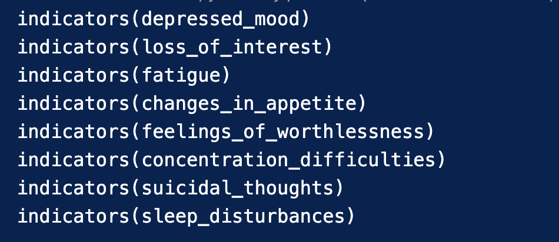
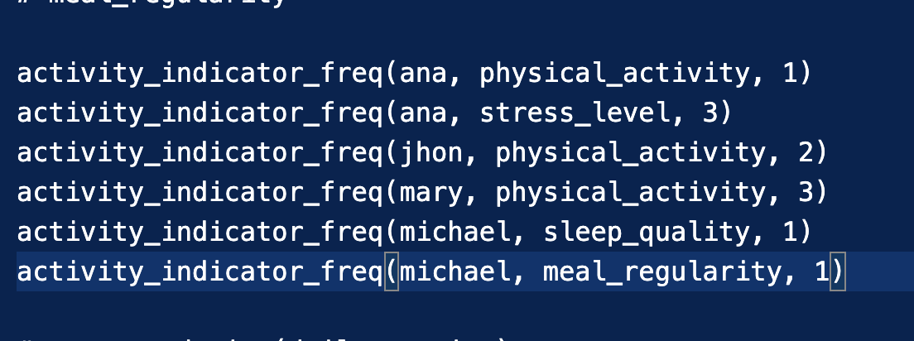
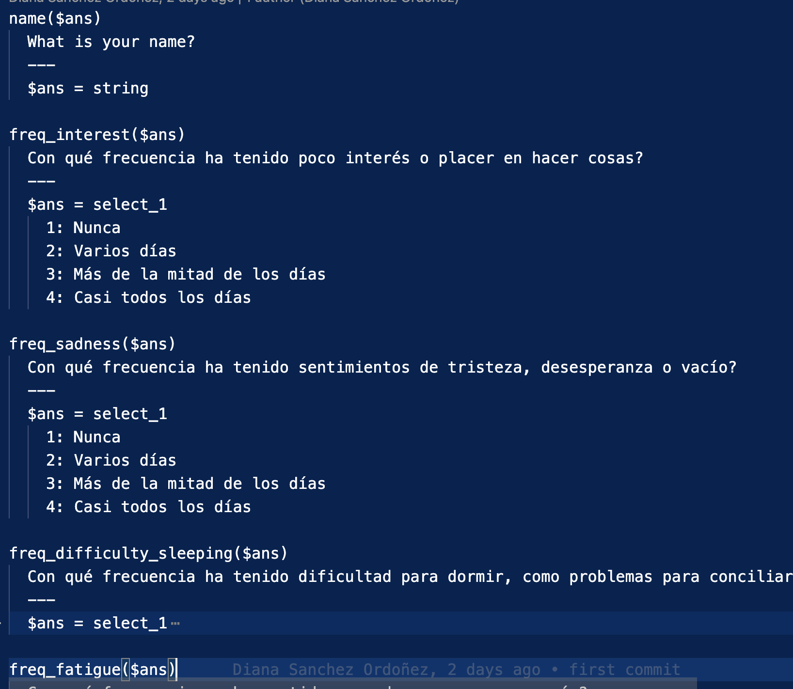

# Sistema Experto para detectar la depresión en adultos

El sistema experto para detectar la depresión combina reglas de inferencia basadas en indicadores como el estado de ánimo, actividad física, estrés, calidad del sueño y regularidad en las comidas. También utiliza la base de conocimientos del cuestionario PHQ-9 para clasificar la severidad de la depresión.

Estos indicadores son procesados mediante el enfoque de forward chaining para determinar la presencia y gravedad de la depresión, generando recomendaciones personalizadas para los pacientes según su nivel de severidad detectado.

## Hechos

## Reglas

## Preguntas 

## Resultados