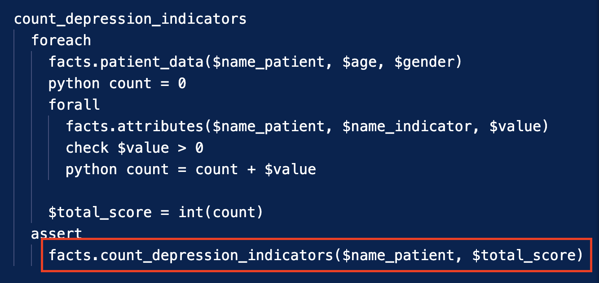

# Sistema Experto para detectar la depresión en adultos

El sistema experto para detectar la depresión combina reglas de inferencia basadas en indicadores como el estado de ánimo, actividad física, estrés, calidad del sueño y regularidad en las comidas. También utiliza la base de conocimientos del cuestionario PHQ-9 para clasificar la severidad de la depresión.

Estos indicadores son procesados mediante el enfoque de forward chaining para determinar la presencia y gravedad de la depresión, generando recomendaciones personalizadas para los pacientes según su nivel de severidad detectado.

## Hechos
* **Indicadores Clínicos:** Estos hechos evalúan diferentes indicadores relacionados con la depresión, tomando en cuenta el CIE-10 y el DSM-V.
Los que ayudan al sistema a evaluar de manera más completa el estado emocional y de salud del paciente, lo que contribuye a una detección más precisa
de la depresión y a la formulación de recomendaciones personalizadas

  

* **Frecuencia de Actividad de los pacientes:** Esta regla mide la frecuencia
de actividad física, el nivel de estrés, la calidad del sueño y la regularidad en
las comidas. La frecuencia de actividad se ha categorizado en tres niveles:
baja, representada por 1 en la escala de frecuencia; media, indicada por 2
en la escala; y alta, denotada por 3 en la escala de frecuencia.

  

## Preguntas 
* **Cuestionario PHQ-9:** Estos hechos son obtenidos de nuestra base de preguntas elaborada en base al [cuestionario sobre la salud del paciente (PHQ-9)](https://med.stanford.edu/fastlab/research/imapp/msrs/_jcr_content/main/accordion/accordion_content3/download_256324296/file.res/PHQ9%20id%20date%2008.03.pdf) como instrumento de tamizaje para la depresión.

  

## Reglas

* **depression_severity:** Esta regla clasifica el nivel de severidad de depresión en los pacientes
según su puntaje total en la escala del PHQ-9. 

  

* **count_depression_indicators:** Calcula el
puntaje total de indicadores depresivos para cada paciente. Este proceso implica
contar y sumar la presencia de indicadores depresivos en los datos del paciente,
como tristeza persistente, fatiga, cambios en el apetito, entre otros, definidos en
nuestra base de hechos previamente (facts.kfb). 

  

* **activity_frequency:** Mide la
frecuencia de actividad física, nivel de estrés, la calidad del sueño y la regularidad
en las comidas, todos ellos evaluados en una escala de low, medium y high.

  

* **recommendation_message:** Brinda mensajes de recomendación para los pacientes según su nivel de severidad de depresión (depression_severity).

  

## Resultados

El sistema identificó a los pacientes que sufren de depresión y proporcionó recomendaciones específicas basadas en el análisis de hechos (facts.kfb) y
reglas(fc_rules.krb).

